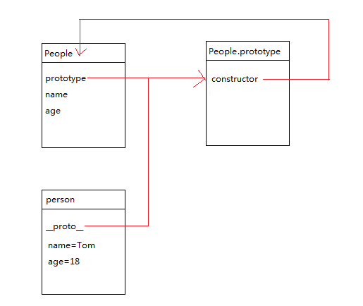
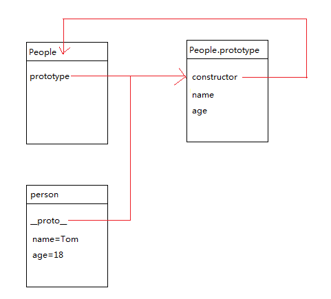
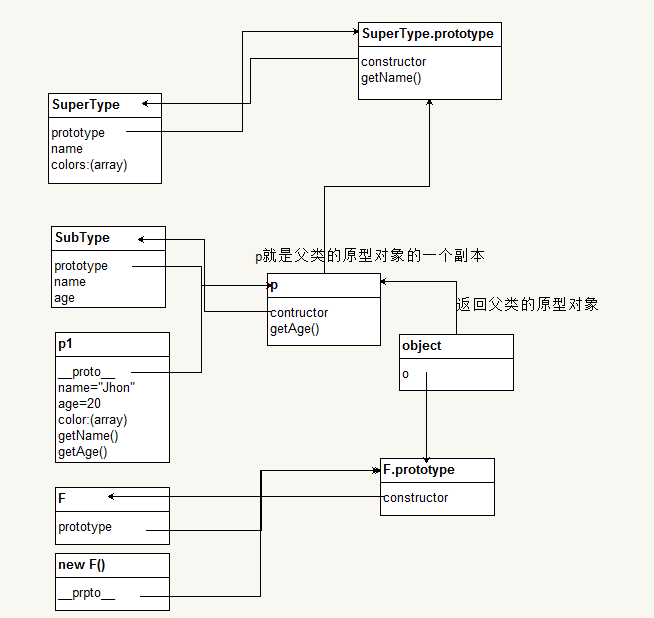

## 面向对象
### 封装
#### 创建一个类
申明一个函数保存在变量中，变量名就是我们的类名，通常类名首字母大写，这是为了将构造函数和普通函数加以区分，在这个函数中通过this添加属性和方法。
```
var People=function(name,age){
    this.name=name;
    this.age=age;
}
```
也可以通过类的原型添加属性和方法
```
People.prototype.say=function(){
    // 说话
}
```
```
People.prototype={
    say:function(){
        // 说话
    }
}
```
以上两种方法，不能混用，第一种是为原型对象赋值，另一种则是将一个对象赋值给类的原型对象。
当我们需要调用的时候要使用new关键字实例化一个新的对象出来
```
var person=new People('Tom',18);
console.log(person.name);//Tom
```
这两种添加属性和方法的形式是有区别的：
1. 通过构造函数添加的属性和方法是在当前对象上添加的，每次创建一个新对象的时候，就会将添加到上面的方法和属性复制一份给新的对象
2. 通过原型添加的，是存在原型对象上的，所有的对象都共用属性和方法
3. 构造函数添加属性和方法

4. 原型对象添加属性和方法

5. 通过构造函数添加的属性和方法，每个新对象都有一个各自独立的地方放置属性和方法
6. 通过原型对象添加的属性和方法，每个对象都指向同一个存放属性和方法的地方

#### 属性和方法的封装
在JavaScript中函数内部的变量以及方法在外界是访问不到的，可以通过这种特性来创建类的私有变量和私有方法。
但是用this创建的属性和方法，每个新创建出来的对象都会拥有，是共有属性和方法，还可以访问到创建类时或对象自身私有属性和方法，属于特权方法。
```
var People=function(name,age){
    var num=1;// 私有属性
    function say(){}// 私有方法
    // 特权方法
    this.getName=function(){};
    this.getAge=function(){};
    this.name=name;// 对象的公有属性
    this.play=function(){};// 对象的共有方法
    // 构造器
    this.setName(name);
    this.setAge(age);
}
```
类在外面通过点语法定义的属性和方法被称为类的静态共有属性和类的静态共有方法。(对象不能访问)
在prototype对象中的属性和方法称为共有属性和共有方法。

#### 闭包
闭包是有权访问另一个函数作用域中变量的函数，即在一个函数内部创建另外一个函数。
闭包类似于延长作用域链的效果，闭包只能包含函数中任何变量的最后一个值。
```
function createFunction(){
    var result=new Array();
    for(var i=0;i<10;i++){
        result[i]=function(){
            return i;
        };
    }
    return result;
}
```
每个函数都是返回的10，因为每个函数的作用域链中都保存着createFunction函数的活动对象，他们引用的是同一个变量i，当createFunction函数返回后，i的值是10。我们可以通过创建另一个匿名函数强制让闭包函数行为符合预期
```
function createFunction(){
    var result=new Array();
    for(var i=0;i<10;i++){
        result[i]=function(num){
            return function(){
                return num;
            };
        }(i);
    }
    return result;
}
```
将执行没匿名函数的结果赋值给数组，每次调用匿名函数的时候，实参i传入形参num中，在怒名函数内部，有创建一个返回num的闭包，这样子，result数组中的每一个函数都拥有自己的num，就可以返回不同的值了。

#### 创建对象的安全模式
创建对象时如果没有使用new关键字，输出的结果是undefined，new关键字可以看做是对当前对象的this不停的赋值，没有new关键字的时候，就会直接执行这个函数，这个函数在全局作用域中执行了，所有在全局作用域中this指向的就是window对象，而我们的person最终的作用要取到People这个类执行的结果，函数中没有return，默认返回undefined，应该使用安全模式避免。
```
var People=function(name,age){
    // 判断执行过程中this是否是当前的这个对象(如果是说明是new创建出来的)
    if(this instanceof People){
        this.name=name;
        this.age=age;
    }else{// 否则重新创建这个对象
        return new People(name,age);
    }
};
```

### 继承
#### 类式继承
```
// 申明父类
function Super(){
    this.superValue=true;
}
// 为父类添加共有方法
Super.prototype.getValue=function(){
    return this.superValue;
};
// 申明子类
function Sub(){
    this.subValue=false;
}
// 继承父类
Sub.prototype=new Super();
// 为子类添加共有方法
Sub.prototype.getSubvalue=function(){
    return this.subValue;
};
var instance=new Sub();
```
1. 类的原型对象的作用就是为类添加共有方法
2. 但是类不能直接访问这些属性个方法，必须通过原型prototype来访问
3. 我们在实例化一个父类的时候，新创建的对象复制了父类构造函数中的属性和方法
4. 将__proto__指向父类的原型对象，这样就拥有了父类原型对象上的属性和方法
5. 如果将这个新创建的对象赋值给子类的原型对象，那么子类的原型对象就可以访问到父类的原型对象上的属性和方法，还可以访问到父类构造函数中的方法
6. 可以通过instanceof来检测某个对象是否是某个类的实例，就是说某个对象是否继承了某个类
```
console.log(instance instanceof Super);// true
console.log(instance instanceof Sub);// true
console.log(Sub instanceof Super);// false
console.log(instance instanceof Object);// true
```
7. 在实现继承的时候是将父类的实例对象赋值给了子类的原型，所以说Sub.prototype继承了Super
8. 但是这种类式继承有两个缺点：
- 由于子类通过其原型prototype对父类实例化，继承了父类，如果子类的一个实例更改了父类从父类构造函数中继承过来的共有就会影响其他子类
```
function Super(){
    this.books=['JavaScript','HTML'];
}
function Sub(){}
Sub.prototype=new Super();
var instance1=new Sub();
var instance2=new Sub();
console.log(instance1.books);//['JavaScript','HTML']
instance1.books.push('CSS');
console.log(instance1.books);//['JavaScript','HTML','CSS']
```
- 由于子类实现继承是靠其原型对象对父类实例化的实现，在创建父类的时候，是无法向父类传递参数的，无法对父类的构造函数进行初始化。

#### 构造函数继承
```
function Super(id){
    // 引用类型共有属性
    this.books=['JavaScript','HTML'];
    // 值类型共有属性
    this.id=id;
}
// 父类申明原型方法
Super.prototype.showBooks=function(){
    console.log(this.books);
};
// 申明子类
function Sub(id){
    // 继承父类
    Super.call(this,id);
}
```
1. call方法可以改变函数的作用环境，在子类中将父类中的变量执行了一遍，由于父类中是给this绑定属性的，因此子类自然就继承了父类的共有属性。
2. 由于没有涉及原型，所以父类的原型方法不会被继承，如果想要被子类继承就必须要放在构造函数中。
3. 每次创建出来的实例都会单独拥有一份，不能共用，违背了代码复用的原则

#### 组合继承
1. 类式继承是通过子类的原型prototype对父类实例化来实现的
2. 构造函数式继承是通过在子类的构造函数作用环境中执行一次父类的构造函数来实现的
3. 组合继承就是将两者结合使用的一种继承
```
function Super(name){
    this.name=name;
    this.books=['JavaScript','HTML'];
}
Super.prototype.getName=function(){
    console.log(this.name);
};
function Sub(name,time){
    // 构造函数式继承父类name属性
    Super.call(this,name);
    this.time=time;
}
// 类式继承
Sub.prototype=new Super();
Sub.prototype.getTime=function(){
    console.log(this.time);
}
```
4. 使用构造函数继承时执行了一遍父类的构造函数，在实现子类原型的类式继承时又调用了一遍父类构造函数

#### 原型式继承
```
function object(o){
    // 申明一个过渡函数对象
    function F(){};
    F.prototype=o;
    return new F();
}
```
```
var person={
    name:'Tom',
    friends:['Jhon','Zero']
}
```
1. 是对类式继承的一种封装，F过渡类中为空，所以消耗的内存较少，可以将F过渡缓存起来
2. object()对传入其中的对象执行了浅复制
3. 必须有一个对象作为另一个对象的基础，然后就可以将它传递给object()函数
4. 憨厚可以根据具体需求进行对得到的具体对象进行修改
5. 另一个对象基础是person对象，将它传入object函数中，然后该函数就会返回一个新对象
6. 这个对象将person作为原型，所以它的原型中就包含一个基本类型值属性以及一个引用类型值属性
7. 引用类型被所有的实例化对象共享
8. ES5新增了Object.create()方法
9. 一个参数用作新对象原型的对象，另一个可选的是为新对象定义额外属性的对象
10. 传入一个参数和object()是一样的，传入两个参数可以覆盖原型对象上的同名属性

#### 寄生式继承
```
var book={
    name:'Tom',
    books:['JavaScript','HTML']
};
function createBook(obj){
    var o=new object(obj);
    o.getName=function(){
        console.log(name);
    }
    return o;
}
```

#### 寄生组合式继承
```
function object(o){
    function F(){};
    F.prototype=o;
    return new F();
}
function inheritPrototype(Sub,Super){
    // 复制一份父类的原型副本保存在变量中
    var p=object(Super.prototype);
    p.constructor=Sub;
    Sub.prototype=p;
}
```
1. 我们需要的仅仅是父类的原型，不需要父类的构造函数
2. 利用寄生式继承浅复制一份父类的原型
3. 但是在进行寄生式继承的时候我们新创建了一个空的构造函数
4. 又将构造函数的原型指向传入的参数
5. 相当于我们将构造函数的原型指针指向了一个空对象
6. 我们需要将对象的构造器重新指回我们的构造函数
7. 又将复制回来的父类的原型副本赋值给子类的原型对象
8. 子类就拥有父类原型中的属性和方法 
```
function object(o){
    function F(){};
    F.prototype=o;
    return new F();
}
function inheritPrototype(SubType,SuperType){
    var p=object(SuperType.prototype);
    p.constructor=SubType;
    SubType.prototype=p;
}
function SuperType(name){
    this.name=name;
    this.colors=['red','blue'];
}
SuperType.prototype.getName=function(){
    console.log(this.name);
}
function SubType(name,time){
    // 构造函数式继承
    SuperType.call(this,name);
    this.time=time;
}
// 寄生式继承父类原型
inheritPrototype(SubType,SuperType);
SubType.prototype.getTime=function(){
    console.log(this.time);
}
```


### 多继承
#### 拷贝继承
```
var extend=function(target,source){
    for(var property in source){
        target[property]=source[property];
    }
    return target;
}
```
1. 只能复制值类型的属性，不能复制引用类型的属性，浅复制
2. jQuery中有深复制，将源对象中的引用类型的属性再次拷贝继承
3. 传递多个对象形成多继承
```
var mix=function(){
    var i=1,// 从第二个参数起为被继承的对象
        len=arguments.length,
        target=arguments[0],// 第一个参数为目标对象
        arg;
    for(;i<len;i++){
        // 缓存当前对象
        arg=arguments[i];
        for(var property in arg){
            target[property]=arg[property];
        }
    }
    return target;
}
```
4. 也可以绑定到原生对象Object上，这样所有的对象都可以拥有这个方法
```
Object.prototype.mix=function(){
    var i=0,// 从第一个参数起为被继承的对象
        len=arguments.length
        arg;
    for(;i<len;i++){
        arg=arguments[i];
        for(var property in arg){
            target[property]=arg[property];
        }
    }
    return target;
}
```
5. 可以直接在对象上调用mix方法

### 多态
多态：同一个方法多种调用方式。
```
function add(){
    var arg=arguments,
        len=arg.length;
    switch(len){
        case 0:return 10;
        case 1:return 10+arg[0];
        case 2:return arg[0]+arg[1];
    }
}
```

### 总结
面向过程：面向过程是一件事“该怎么做”
面向对象：面向对象是一件事“该让谁来做”
面向对象特点：封装、继承、多态
JS中的封装：私有属性和方法
JS中创建对象的方式：
- 工厂模式
- 构造函数模式
- 原型模式
- 组合使用构造函数模式和原型模式
- 动态原型模式
- 寄生构造函数模式
- 稳妥构造函数模式
JS中继承的方式：
- 原型链继承(类式继承)
- 借用构造函数继承
- 组合继承
- 原型式继承
- 拷贝继承
- 寄生式继承
- 寄生组合是继承
