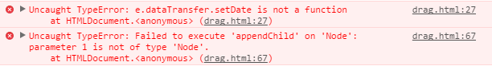

### 拖拽时报错

1. 将当前的被拖拽元素的id号存储到事件源对象中时书写错误
```
e.dataTransfer.setDate('key',e.target.id);//错误
e.dataTransfer.setData("key", e.target.id);//正确
```
2. 拖拽元素要设置id
```
<p draggable="true" id="pp">试着将我拖过去</p>
```